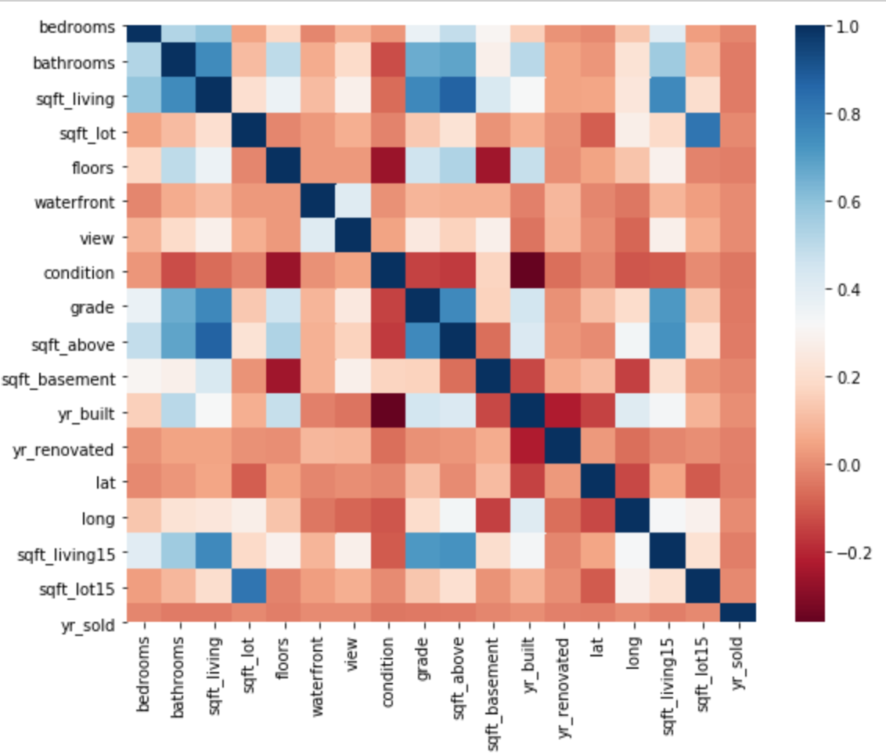

# Predicting Housing Prices Using Linear Regression
### Flatiron Data Science Program - Project 2 By Khyatee Desai October 23, 2020

# Background
The purpose of this project is to create a linear regression model that will **predict the prices of homes** sold in the Seattle, WA area. This repository contains the following components:

- EDA & modeling process notebook [`eda_modeling_process.ipynb`](eda_modeling_process.ipynb)
- final model notebook [`final_model.ipynb`](final_model.ipynb)
- labeled training data [`kc_house_data_train.csv`](kc_house_data_train.csv)
- unlabeled holdout data [`housing_preds_khyatee.csv`](housing_preds_khyatee.csv")
- a CSV file of model predictions on the holdout set [`Predict_holdout.ipynb`](Predict_holdout.ipynb)

# Data Set Information

* **id** - unique ID for a house
* **date** - Date day house was sold
* **price** - Price is prediction target
* **bedrooms** - Number of bedrooms
* **bathrooms** - Number of bathrooms
* **sqft_living** - square footage of the home
* **sqft_lot** - square footage of the lot
* **floors** - Total floors (levels) in house
* **waterfront** - Whether house has a view to a waterfront
* **view** - Number of times house has been viewed
* **condition** - How good the condition is (overall)
* **grade** - overall grade given to the housing unit, based on King County grading system
* **sqft_above** - square footage of house (apart from basement)
* **sqft_basement** - square footage of the basement
* **yr_built** - Year when house was built
* **yr_renovated** - Year when house was renovated
* **zipcode** - zip code in which house is located
* **lat** - Latitude coordinate
* **long** - Longitude coordinate
* **sqft_living15** - The square footage of interior housing living space for the nearest 15 neighbors
* **sqft_lot15** - The square footage of the land lots of the nearest 15 neighbors

# Process
## Data Prep
- check for null values
- change date strings to datetime objects
- drop irrelevant columns (id and index 0)
- impute massive outliers by setting them at 6 standard deviations from the mean
## Exploratory Data Analysis
- inspect scatter matrix for multicollinearity and normality
- Create zipcode dummy variables for AOVA test

### Statistical Tests:
**Business Question 1: Does a house being located on water impact its price?** 
**Test:**  2-sample one-tail Welch's T-Test (significance level: 0.05)
**Rationale:**  Comparing the means of two independent samples with different variances & sizes  
**Ho:**  Houses on a waterfront sell for the same amount on average as houses not on a waterfront.  
**Ha:**  Houses on a waterfront sell for more on average than houses not on a waterfront.
**Outcome:** P-value is 3.47e-23, which is lower than 0.05 alpha, indicating we can reject the null hypothesis in favor of the alternative, that houses on a waterfront sell for more on average than houses not on a waterfront.

**Business Question 2:  Does location (zipcode) impact house price?** 
**Test:** ANOVA Test
**Rationale:**  Comparing means of several independent samples  
**Ho:**  There is no difference in the average price of houses in different zip codes.  
**Ha:**  Houses in different zip codes have different average house prices.
**Outcome:** Very low P-values for all zip codes indicate that we can reject the null hypothesis in favor of the alternative, that houses in different zip codes have different prices on average

**Business Question 3:  Do houses with basements sell for higher prices?** 
**Test:** 2-Sample Welch's T-Test (significance level: 0.05)
**Rationale:**  Comparing means of several independent samples with different variances & sample sizes  
**Ho:**  There is no difference in the average price of houses with and without basements.  
**Ha:**  Houses with basements sell for higher prices on average.
**Outcome:** The P-value is very small (1.94e-102), which is lower than the alpha level 0.05, meaning we can reject the null hypothesis in favor of the alternative, that houses with basements sell for higher prices on average.

## Feature Engineering
- `yrs_old` - house year sold - year built
- `miles_from_city` - distance of each house from Pikes Place Market
- `feature1_X_feature1` - interaction features derived by multiplying two features together
- `log_featurex` - log transformations derived by taking the log of each feature
- `featurex_^2` - polynomial features derived by squaring and cubing each feature

## Feature Selection
`Model_1`
**Features:** Included all features from interactions, log transforms, polynomial transforms, and zipcode dummy variables
**R-Squared:** 0.22 Train, 0.004 Test
**Interpretation:**  R-squared values are very low, indicating there are too many conflicting features  
`Model_2`
**Features:** Dropped multicollinear features determined from very high VIF scores
**R-Squared:** 0.399 Train, 0.425 Test
**Interpretation:**  Better than model one, but indicates need for further feature selection.    
`Model_3`
**Features:** Used K-Best Feature selection with F-regression, and included 139 'best' features
**R-Squared:** 0.873 Train, 0.834 Test
**Interpretation:**  Significantly better performing than initial methods  
`Model_4`
**Features:** Used Recursive Feature Elimination to determine 'best' features to retain
**R-Squared:** 0.866 Train, 0.872 Test
**Interpretation:**  Best performance, so this is the method used for final model 

## Model Interpretation
Inspect Coefficients - many are difficult to interpret due to transformations.
- presence of a waterfront changes price by $139589015.5
- change in year built changes price by $ 72026375.3
- change in number of floors changes price by $ 12694153.7 

`Final_Model`
**Features:** RFE
**R-squared:**  0.8813219725128786
**RMSE:**  128603.46478124417
